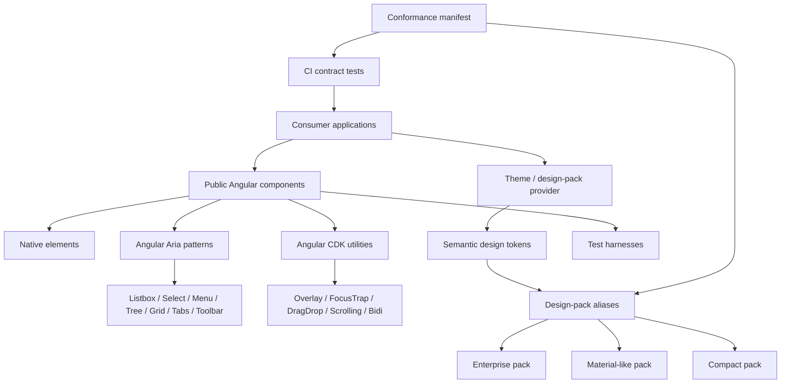
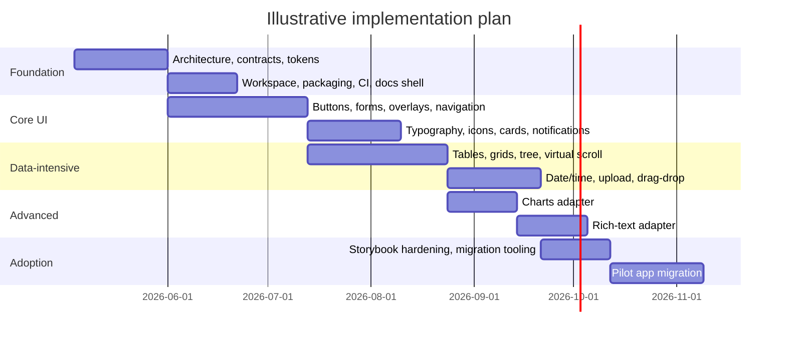

# Enterprise Angular Component Library Design for Multi-Variation, Consistent, HCI-Aligned Applications

> Planning context: this report is referenced from [MASTER-PLAN.md](./MASTER-PLAN.md) and [ENTERPRISE-RESEARCH-ALIGNMENT.md](./ENTERPRISE-RESEARCH-ALIGNMENT.md). Filename note: previously `deep-research-report (1).md`.

## Executive Summary

The strongest conclusion from the current Angular ecosystem is that no single off-the-shelf library simultaneously gives an enterprise team all three of the following: broad enterprise component coverage, full freedom to support multiple branded design variations, and a hard guarantee that every selected design variation implements the entire required component set consistently. Angular’s own ecosystem now contains two especially relevant building blocks for solving that gap: first, Angular Aria, which is explicitly positioned for WCAG-compliant custom-styled design systems and enterprise component libraries; second, the Angular Package Format, which supports ESM packaging, secondary entry points, partial compilation, flattened ES modules, and tree-shaking-oriented metadata. Together, they make a custom enterprise library materially more feasible than it was a few years ago. citeturn33view1turn42search0turn34view2

For this specific objective, the recommended strategy is **not** to expose applications directly to Angular Material, NG-ZORRO, PrimeNG, or Ionic as the public design-system API. Instead, build an organization-owned library on top of Angular Aria, Angular CDK, native HTML elements, and a tokenized theming layer; then add one or more **design packs** that are required to pass a conformance contract proving that every mandatory component exists in the selected visual language. That recommendation is supported by Angular’s accessibility guidance to reuse native elements where possible, Angular Aria’s positioning for custom enterprise libraries, and Angular Package Format’s support for secondary entry points and optimization-friendly packaging. citeturn33view0turn33view1turn42search0turn34view2

From a platform and lifecycle standpoint, the practical baseline as of April 2026 is to support Angular 20 and 21 at launch, because Angular 21 is in active support and Angular 20 remains in LTS; Angular majors ship on an approximately six-month cadence and are typically supported for 18 months. That means the library should be designed with predictable migrations, `ng update` support, and at least one compatibility review per Angular major. citeturn34view0turn10search2turn11view2

The report therefore recommends a reference architecture with five non-negotiable properties: a semantic component contract, design-pack completeness checks, runtime theming through CSS custom properties, APF-compliant component-per-entry-point packaging, and CI gates for keyboard behavior, focus management, accessibility snapshots, and visual regression. If implemented this way, design selection becomes a controlled product decision rather than a styling free-for-all, and consuming applications remain visually synchronized while still allowing multiple approved design languages. citeturn2search5turn33view1turn42search0turn6search1turn6search8turn6search2

## Goals, Scope, Audience, and Constraints

The goal of the library should be to provide a **single enterprise UI contract** for Angular applications that can be rendered through multiple approved visual systems without allowing functional or stylistic drift. In scope are reusable UI components, headless accessibility/interaction primitives, tokenized theming, documentation, testing, migrations, and release governance. Out of scope should be bespoke page layouts for individual products, one-off product branding that bypasses design-pack rules, and building charting or rich-text engines from scratch when an adapter suffices. This scope aligns with Angular’s library model, Angular Aria’s intended design-system use cases, and Angular’s multi-project workspace support for enterprise monorepos. citeturn11view1turn33view1turn42search2

The primary audience is threefold. **Designers** need traceable tokens, visual specifications, and component states. **Frontend engineers** need stable Angular APIs, strong typing, tree-shakeable imports, and migration tooling. **Architects and platform owners** need support matrices, versioning policy, governance, and quality gates. Angular’s style guide emphasizes consistency across projects, and Angular’s library tooling explicitly supports `ng add`, `ng generate`, and `ng update`, which are precisely the kinds of enterprise affordances this audience needs. citeturn4search5turn11view2turn10search2

For target platforms, the recommended default is **modern Angular web applications on desktop and mobile browsers**, with responsive behavior across desktop, tablet, and phone breakpoints. Ionic’s documentation confirms that a mobile-first cross-platform posture is a distinct specialization, while Angular Material and Angular Components position themselves primarily as component infrastructure for web applications. Unless the organization is explicitly mobile-shell-first, the base library should optimize for enterprise web apps first and expose a later mobile-optimized design pack if needed. citeturn21search7turn22search21turn22search14

For Angular versions, because the user left this unspecified, the best supported policy is: **launch with Angular 20 LTS and Angular 21 active support; evaluate Angular 22 after GA**. Angular’s release schedule already shows v22 scheduled for the week of 2026-06-01, while v21 and v20 remain supported on different tracks. This minimizes maintenance burden while covering the versions most likely to be in enterprise estates in 2026. citeturn34view0

The non-negotiable constraints are accessibility, performance, internationalization, theming, and RTL. WCAG conformance at **2.1 AA** should be the baseline; WAI-ARIA Authoring Practices should govern composite widgets; Angular’s accessibility guidance says to prefer native elements and to manage focus deliberately after navigation; Angular’s i18n system uses `@angular/localize`, `LOCALE_ID`, and locale-aware formatting; NG-ZORRO and Angular CDK explicitly document RTL support; Ionic and W3C CSS custom properties make runtime theme switching practical. citeturn2search6turn2search7turn33view0turn4search4turn4search16turn4search22turn37search0turn3search1turn22search3turn2search5

A useful enterprise test/support matrix is to mirror the Angular Components team’s browser and assistive-technology discipline: current major browsers, plus focused screen-reader testing across NVDA/JAWS, VoiceOver, TalkBack/Android Accessibility Suite, and ChromeVox. That does not guarantee universal accessibility, but it is a defensible operational baseline. citeturn8view0

## Market Survey and Comparative Assessment

The current ecosystem options are all defensible, but they solve slightly different problems. Angular Material and the broader Angular Components stack provide the strongest official Angular-native foundation, especially now that Angular Aria offers headless accessible directives for common patterns and Angular Material/CDK continue to emphasize accessibility, performance, internationalization, testing, and support alignment with Angular itself. NG-ZORRO is explicitly enterprise-focused and broad in web-application coverage, particularly forms and data display. PrimeNG offers the widest out-of-the-box Angular UI breadth and a notably flexible styled/unstyled model, plus commercial LTS/PRO options. Ionic is excellent when the product goal is cross-platform mobile/PWA UI with iOS/Material modes, but it is less naturally aligned with dense desktop enterprise CRUD and analytics surfaces. citeturn8view0turn33view1turn37search3turn36view0turn38search11turn22search14turn21search7turn39search2

### Comparative table

| Option | Components covered | Theming model | Accessibility posture | Package footprint proxy* | Licensing | Community / activity | Enterprise-relevant features | Fit for this initiative | Key sources |
|---|---|---|---|---|---|---|---|---|---|
| Angular Material + CDK + Angular Aria | Strong core web controls plus official headless/accessibility primitives and component infrastructure; ideal for foundations, but not a full enterprise inventory by itself. | Customizable within the Material Design bounds; CDK/Aria are styling-agnostic building blocks. | Angular Material aims to be fully accessible; Angular Aria is explicitly for WCAG-compliant custom-styled components; Angular Components documents browser and screen-reader support. | ~7.6 MB unpacked proxy retrieved from package metadata search; actual shipped bundle depends on entry points and tree-shaking. | MIT. | ~25k stars; latest release 21.2.9 on Apr 29, 2026. | Official Angular support alignment; CDK; Angular Aria; strong testing and support policy; browser/screen-reader baseline. | **Best foundation** for a custom enterprise library, but not broad enough alone if you need charts, rich text, enterprise table behavior, and multi-pack parity immediately. | citeturn8view0turn33view1turn9view0turn19search4turn16search3 |
| NG-ZORRO | 70+ components with strong forms, upload, tree, table, notifications, layout, and enterprise-style data display. | Less-variable theming, predefined themes, dynamic switching, global config. | Internationalization for dozens of languages; RTL via `dir`/CDK; enterprise positioning; performance guidance around OnPush. | 27.8 MB unpacked proxy from package metadata search. | MIT. | ~9.1k stars; latest release 21.2.2 on Apr 13, 2026. | Angular-major alignment, global configuration at runtime, advanced table features, rich upload/tree/table coverage, SSR noted. | **Strong accelerator** for enterprise web CRUD/admin apps, but more visually opinionated and Less-centric than a multi-skin token architecture. | citeturn37search3turn36view0turn36view1turn36view2turn36view3turn37search0turn37search11turn9view1turn19search1 |
| PrimeNG | Broadest out-of-the-box Angular suite; official docs call it comprehensive/feature-rich and highlight tables, file upload, icons, themes, and many supporting categories. | Styled and unstyled modes; design-agnostic; prebuilt themes plus customization tooling; Tailwind integration documented. | Official accessibility guide says PrimeNG targets AA-level compliance; component pages document keyboard and screen-reader behavior. | 11.9 MB unpacked proxy from npm snippet. | Open source; commercial LTS/PRO support available in official docs. | ~12.4k stars; latest release 21.1.6 on Apr 13, 2026. | LTS and PRO support, design-agnostic styled/unstyled approach, broad component inventory. | **Best off-the-shelf breadth**, but still requires governance and wrapping if the enterprise must guarantee cross-pack style parity and stable internal APIs. | citeturn38search11turn22search14turn28search7turn22search2turn22search8turn35view5turn28search2turn8view3turn13search2 |
| Ionic | High-level mobile/PWA components for navigation, lists, media, forms, alerts, pickers, and cross-platform app shells. | CSS variables, dark mode, platform modes, theming primitives built into components. | Strong component-level accessibility language in docs; many controls mention focus control, keyboard support, and mobile integration. | No like-for-like published figure was retrieved in the reviewed sources. | MIT. | ~52.5k stars; latest release v8.8.5 on Apr 29, 2026. | Cross-platform mobile/PWA focus, Web Components basis, iOS/Material modes, enterprise platform/services. | **Best for mobile-first design systems**, but not the best base for dense desktop enterprise data applications. | citeturn21search7turn22search3turn22search15turn39search2turn39search0turn39search6turn9view2turn21search5 |
| Custom design system on Angular Aria + CDK | Whatever the enterprise defines, provided the contract is enforced. | Full control through semantic tokens, CSS variables, and pack-specific aliases. | Highest potential quality if WCAG/APG rules are enforced in the platform, not left to app teams. | Depends on selected inventory and entry-point strategy. | Internal / organization defined. | Internal governance. | Can be purpose-built for support policy, regulated workflows, brand packs, migration tooling, and conformance tests. | **Best match** for the stated requirement. | citeturn33view1turn33view0turn42search0turn34view2 |

\* *The ecosystem does not publish a single like-for-like “bundle size” number across all libraries in a way that is directly comparable. Angular Package Format explicitly notes that actual application payload depends on entry-point structure, flattened ESM/FESM output, code splitting, and tree-shaking metadata. For that reason, the table uses published package-footprint proxies where they surfaced in retrieved package metadata and treats them only as rough comparison points, not shipped runtime cost.* citeturn42search0turn11view0turn13search2turn19search1turn19search4

The comparative takeaway is straightforward. If the goal were fastest delivery with broad CRUD/admin coverage, PrimeNG and NG-ZORRO would be the strongest candidates. If the goal were mobile shell quality, Ionic would stand out. But for **“multiple design variations with guaranteed complete, synchronized component coverage”**, the correct long-term answer is an enterprise-owned API surface with design packs, not direct dependency on any single library’s public component names. Angular’s own accessibility and packaging stack now provides enough first-party substrate to make that strategy operationally sound. citeturn33view1turn42search0turn37search3turn38search11turn21search7

## Canonical Inventory and Variation Model

The single most important design rule is this: **a design is selectable only if it is complete**. In other words, “theme” cannot mean “I changed colors and a few components.” It must mean “this design pack implements the mandated inventory with approved variants, states, densities, and accessibility semantics.” Angular Aria’s existence is especially important here because it lets the enterprise keep behavior consistent while varying appearance deliberately. citeturn33view1

A practical variation model should separate **what the component is** from **how it looks**. The library should expose stable semantic components and a finite set of cross-cutting variation axes. That keeps the API small while allowing multiple approved looks.

### Recommended variation axes

| Axis | Purpose | Typical values |
|---|---|---|
| Design pack | Approved visual language | `enterprise`, `material-like`, `compact`, `touch` |
| Density | Information density and hit-area policy | `comfortable`, `compact`, `touch` |
| Emphasis | Visual prominence | `solid`, `outline`, `ghost`, `link` |
| Tone | Semantic intent | `neutral`, `brand`, `success`, `warning`, `danger`, `info` |
| Surface | Fill/elevation style | `filled`, `outlined`, `elevated`, `subtle` |
| Size | Control sizing | `xs`, `sm`, `md`, `lg` |
| State | Interaction and validation | `default`, `hover`, `focus-visible`, `active`, `disabled`, `loading`, `readonly`, `error` |

The accessibility semantics for widgets such as grid, listbox, tree, toolbar, menu, and menubar should not vary by design pack; only the visual tokens should vary. WAI-ARIA Authoring Practices and Angular Aria document the behavioral expectations for those patterns, including keyboard navigation and focus movement. citeturn2search7turn31search0turn31search1turn31search2turn33view1

### Canonical component inventory and required variations

| Component family | Required members | Required variations / styles | Non-negotiable accessibility and HCI hooks |
|---|---|---|---|
| Actions | button, icon button, split button, button group, toggle button, FAB/primary action | emphasis, tone, size, loading, destructive, selected | Native `<button>` or `<a>` use where possible; visible focus; disabled semantics; keyboard activation; accessible name |
| Text entry | text input, textarea, search, password, masked input, input group | filled/outlined, size, prefix/suffix, status, readonly, clearable | Proper label association, `aria-describedby`, error/help text, autocomplete modes |
| Choice controls | checkbox, radio, switch, segmented control, slider, stepper, rating | density, size, tone, validation state | Native inputs when feasible; arrow-key behavior where appropriate; group labeling |
| Selection / popup | select, multiselect, autocomplete, combobox, cascader/tree select | single/multi, async loading, chips, clearable, compact | Listbox/combobox semantics, typeahead, escape behavior, focus restoration |
| Date and time | date picker, date range, time picker, date-time picker, calendar | single/range, inline/popup, locale/timezone aware, density | Grid keyboard model for calendars, locale formats, clear labels, screen-reader instructions |
| Data display | table, data grid, list, descriptions, statistic, badge, tags, progress, skeleton, empty state | density, bordered/borderless, sticky headers, row states | Use semantic table when read-only; interactive grid pattern only when required; sortable/filterable announcements |
| Hierarchical data | tree, tree grid, nested navigation tree | single/multi select, lazy load, virtualized, compact | Tree keyboard model, expand/collapse semantics, typeahead, RTL-safe navigation |
| Layout primitives | stack, inline, grid, container, divider, spacer, splitter, side panel layout | responsive gap, density, collapsible regions | Landmark usage, predictable reading order, resize handles with keyboard fallback |
| Navigation | breadcrumb, tabs, menu, menubar, sidenav, pagination, steps, top app bar | horizontal/vertical, compact, icon+label, collapsible | `aria-current`, roving tabindex where applicable, focus after route changes |
| Overlays | dialog, drawer, popover, tooltip, context menu, bottom sheet | modal/non-modal, size, placement, scroll strategy | Focus trap for modal dialogs, escape/close affordances, inert/background handling, focus return |
| Feedback and messaging | alert, toast, inline validation, notification center, confirm dialog | severity, placement, transient/persistent | Live-region strategy, queuing rules, non-blocking vs blocking distinction |
| Content and identity | card, avatar, typography, icon, image, empty states, watermark if required | heading scale, density, aspect ratio, tonal surfaces | Text hierarchy, contrast, icon labeling, decorative imagery rules |
| File handling | file upload, drag-drop zone, attachment list, preview tile | single/multi file, async upload, validation, compact | Hidden native file input for AT, progress/status updates, keyboard-operable controls |
| Rich authoring | rich text editor shell, markdown preview, mention/autocomplete, toolbar | compact/full, read-only/edit modes | Toolbar keyboard model, heading/list semantics, paste sanitization, plain-text fallback |
| Visualization | chart wrappers, KPI cards, legends, data summary panels | line/bar/area/pie/bullet, compact/dashboard variants | Color contrast, legend accessibility, table/text fallback, reduced-motion respect |
| Interaction utilities | virtual scroll, drag-drop, resize, focus trap, live announcer, skip link, scroll container hooks | horizontal/vertical, sortable/movable, density-aware | Focus preservation, keyboard alternative for drag actions, SR announcements |

This inventory intentionally extends beyond the common “buttons and inputs” scope because enterprise applications tend to fail at consistency in the advanced zones: tables, hierarchical data, overlays, notifications, upload, and authoring. Angular Aria explicitly covers several of the hard interaction patterns such as autocomplete, listbox, select, multiselect, menu, menubar, toolbar, tabs, tree, and grid, while Angular CDK and Angular accessibility guidance cover focus traps and accessibility utilities. citeturn33view1turn33view0

The practical implication is that **charts and rich text should be adapter components**, not homemade engines. The enterprise library should own the API, tokens, states, and accessibility contract, but can wrap a chosen editor or chart engine behind that contract. That keeps the public platform coherent without recreating entire product categories from first principles.

## Reference Architecture and API Design

The recommended architecture is a **behavior layer + token layer + design-pack layer**. Behavior belongs to Angular Aria, Angular CDK, and native elements. Tokens belong to semantic design tokens expressed primarily through CSS custom properties. Design packs map those semantic tokens into concrete visual systems. Public Angular components sit on top and expose consistent APIs regardless of chosen pack. This architecture matches Angular Aria’s intended use for enterprise component libraries with custom styling, Angular’s recommendation to augment native elements instead of replacing them, and CSS-custom-property-based runtime theming supported by web standards and systems such as Ionic. citeturn33view1turn33view0turn2search5turn22search3



A multi-project Angular workspace is a good fit here because Angular explicitly documents multi-project workspaces as suitable for advanced users and enterprises following a monorepo style. Use that workspace to keep applications, docs, testing, migrations, and packages together while still publishing a clean set of library entry points. citeturn42search2turn11view1

### Recommended folder structure

```text
workspace/
  apps/
    docs-site/
    storybook-host/
    sandbox/
    migration-playground/
  packages/
    core/
      src/
        lib/
          primitives/
          directives/
          aria/
          overlay/
          tokens/
        public-api.ts
    components/
      button/
      form-field/
      input/
      select/
      dialog/
      table/
      tree/
      upload/
      ...
    design-packs/
      enterprise/
      material-like/
      compact/
      touch/
    icons/
    typography/
    charts-adapter/
    rich-text-adapter/
    testing/
      harnesses/
      matchers/
    schematics/
      ng-add/
      ng-generate/
      ng-update/
  tools/
    token-build/
    conformance-check/
    docs-extract/
  .storybook/
  angular.json
  package.json
  tsconfig.json
```

The public API should prefer **standalone components and directives**, stable semantic names, and composition over inheritance. Angular’s guidance is explicit: reuse native elements where possible; use content projection when the native control must remain directly available to consumers; and use directive composition to assemble reusable behavior. In practice, that means `button[uiButton]` is often preferable to a completely custom button element, and a form-field container should project a real `<input>` or equivalent control rather than hiding it behind an opaque shell. citeturn33view0turn4search21turn4search15

### API design patterns to enforce

The public API should follow these rules:

1. **Semantic names over visual names.** Prefer `UiButton`, `UiDialog`, `UiDataGrid`, `UiNotificationCenter`; avoid style names in import paths.
2. **Variant enums, not arbitrary class names.** Consumers choose from supported variants; they do not hand-craft style combinations.
3. **Composable state and content APIs.** Prefer inputs such as `tone`, `variant`, `size`, `loading`, `invalid`, and content projection slots such as `startIcon`, `endIcon`, `header`, `footer`.
4. **Headless-first internals.** Behavior is implemented once, then skinned by token consumption.
5. **No app-local structural overrides.** Applications may set tokens and documented slots, but may not pierce component internals as their primary extension model.
6. **Harness-first testability.** Every major component exposes a first-class testing harness or equivalent programmer-facing automation surface.

A small but important additional rule is that every design pack should ship a **manifest** declaring the mandatory components and variants it supports. CI must fail if a pack is incomplete.

### Sample code snippet

```ts
// packages/core/src/lib/design-pack.ts
export type UiVariant = 'solid' | 'outline' | 'ghost' | 'link';
export type UiTone = 'neutral' | 'brand' | 'success' | 'warning' | 'danger';
export type UiDensity = 'comfortable' | 'compact' | 'touch';

export interface UiDesignPackManifest {
  id: string;
  densityModes: UiDensity[];
  components: {
    button: UiVariant[];
    input: Array<'filled' | 'outlined'>;
    dialog: Array<'modal' | 'non-modal'>;
    table: Array<'comfortable' | 'compact'>;
    tooltip: ['default'];
  };
}

export const enterprisePack: UiDesignPackManifest = {
  id: 'enterprise',
  densityModes: ['comfortable', 'compact'],
  components: {
    button: ['solid', 'outline', 'ghost', 'link'],
    input: ['filled', 'outlined'],
    dialog: ['modal', 'non-modal'],
    table: ['comfortable', 'compact'],
    tooltip: ['default']
  }
};
```

This manifest is simple on purpose. The platform should treat it as a contract artifact consumed by tests, docs generation, and release gates.

### Theming system

The theming system should be built around **semantic design tokens rendered as CSS custom properties**, with SCSS retained only for authoring-time mixins, token generation, and compile-time maps. CSS variables are the correct runtime layer because they are standards-based, support runtime changes, and are already central to systems such as Ionic. PrimeNG’s current positioning is especially informative here: it explicitly supports styled and unstyled modes and presents itself as design agnostic rather than enforcing a single visual language. citeturn2search5turn22search3turn22search15turn22search14turn28search7

A robust token hierarchy should look like this:

- **Reference tokens**: raw palette, spacing scale, type ramp, motion durations.
- **Semantic tokens**: `--ui-color-action-bg`, `--ui-color-surface-raised`, `--ui-font-body-sm`, `--ui-border-focus`, `--ui-size-control-md`.
- **Component tokens**: `--ui-button-bg`, `--ui-dialog-shadow`, `--ui-table-row-height`.
- **State tokens**: hover/focus/pressed/disabled/error/warning/success.
- **Context tokens**: density, dark mode, RTL spacing flips, high-contrast overrides.

Design packs should never redefine component structure. They should only provide token aliases and optional pack-specific ornamentation within documented boundaries.

### Sample CSS token bridge

```scss
:root,
[data-ui-pack='enterprise'] {
  --ui-color-brand-600: #0057d8;
  --ui-color-surface-default: #ffffff;
  --ui-color-text-default: #1f2937;

  --ui-button-bg: var(--ui-color-brand-600);
  --ui-button-fg: #ffffff;
  --ui-button-radius: 8px;
  --ui-control-height-md: 40px;
}

[data-ui-density='compact'] {
  --ui-control-height-md: 32px;
}

.ui-button {
  min-height: var(--ui-control-height-md);
  border-radius: var(--ui-button-radius);
  background: var(--ui-button-bg);
  color: var(--ui-button-fg);
}
```

### Sample Angular component pattern

```ts
import { ChangeDetectionStrategy, Component, computed, input } from '@angular/core';

@Component({
  selector: 'button[uiButton], a[uiButton]',
  standalone: true,
  template: `
    <span class="ui-button__content">
      <ng-content select="[startIcon]"></ng-content>
      <ng-content></ng-content>
      <ng-content select="[endIcon]"></ng-content>
    </span>
  `,
  host: {
    class: 'ui-button',
    '[attr.data-variant]': 'variant()',
    '[attr.data-tone]': 'tone()',
    '[attr.data-size]': 'size()',
    '[attr.aria-busy]': 'loading() ? "true" : null',
    '[class.is-loading]': 'loading()'
  },
  changeDetection: ChangeDetectionStrategy.OnPush
})
export class UiButtonComponent {
  variant = input<'solid' | 'outline' | 'ghost' | 'link'>('solid');
  tone = input<'neutral' | 'brand' | 'success' | 'warning' | 'danger'>('brand');
  size = input<'sm' | 'md' | 'lg'>('md');
  loading = input(false);

  readonly isQuiet = computed(() => this.variant() === 'ghost' || this.variant() === 'link');
}
```

Signals are a reasonable default for local state and derivations, and `OnPush` remains a sensible default for library components concerned with predictable performance boundaries. Angular’s current documentation covers signals, and Angular components allow change-detection strategy control at the component level. citeturn4search9turn4search18

## Quality, Packaging, Delivery, and Documentation

The packaging model should follow the Angular Package Format closely. Use **partial-Ivy**, ESM, secondary entry points, flattened ES modules, bundled type definitions, `"exports"` mappings, and `"sideEffects": false` where valid. Angular’s APF documentation is explicit that entry points are the unit of lazy loading and that fine-grained secondary entry points are a key optimization strategy; it also explicitly recommends partial compilation for published libraries. This is exactly the right basis for a component library in which teams should be able to import only `button`, `dialog`, or `table` without dragging in the whole system. citeturn42search0turn34view2turn11view0

### Packaging recommendations

- One logical component family per secondary entry point.
- A separate `testing` entry point for test harnesses and custom matchers.
- A separate `icons` entry point.
- Separate design-pack entry points so consumers can preload exactly one approved pack.
- Schematics for `ng add`, `ng generate`, and `ng update`.
- Exported CSS assets only where necessary; otherwise prefer token-driven runtime styling.

### Sample `ng-package.json`

```json
{
  "$schema": "../../node_modules/ng-packagr/ng-package.schema.json",
  "dest": "../../dist/components/button",
  "lib": {
    "entryFile": "src/public-api.ts"
  },
  "allowedNonPeerDependencies": []
}
```

Angular’s library tooling and schematics support make migrations and installation support first-class. `ng add` should install one default design pack and required providers; `ng generate` should scaffold wrappers/adapters; `ng update` should apply migrations and deprecation fixes. citeturn11view2turn10search4

Testing should be layered. For **unit and component tests**, Angular’s current CLI testing guide states that the default setup for new Angular CLI projects uses **Vitest**, though Karma remains supported. For **browser-driven end-to-end testing**, Playwright is a strong fit because it supports Chromium, WebKit, and Firefox, bundles runner/assertions/tooling, and includes resilient waiting behavior. For **visual regression**, Playwright supports `toHaveScreenshot`, while Storybook’s official docs position Chromatic as native visual testing for stories. For **accessibility verification**, Playwright supports accessibility testing and ARIA snapshots, which are especially useful for verifying that component semantics remain correct over time. citeturn40search2turn40search5turn40search6turn40search3turn5search0turn6search23turn6search1turn6search8turn6search2

That leads to the following CI gate structure:

- typecheck
- lint
- unit/component tests
- Storybook build
- contract tests against design-pack manifests
- accessibility snapshots and keyboard-path smoke tests
- visual regression
- APF packaging validation
- publish-to-canary on main
- stable release only after visual/a11y sign-off

Angular’s accessibility guidance also gives several concrete rules that should be encoded as tests or review gates: prefer native elements, bind ARIA correctly, trap focus in modals, update focus after route changes, and apply `aria-current` for active links. Those are not optional style tips; they should be enforced at platform level. citeturn33view0

### Release flow

The versioning and release strategy should use **Semantic Versioning**, because the specification explicitly requires a clear public API and standardized major/minor/patch meaning. Package-registry release channels should use stable and prerelease tags, with prereleases published under a non-default dist-tag such as `next`. Angular’s own release cadence provides a useful operational rhythm: expect compatibility reviews at least once per major train. citeturn41search0turn41search2turn34view0

```mermaid
flowchart LR
    A[Pull request] --> B[Lint + typecheck]
    B --> C[Unit/component tests]
    C --> D[Storybook build]
    D --> E[Accessibility snapshots + keyboard tests]
    E --> F[Visual regression]
    F --> G[APF package build]
    G --> H[Canary publish with next tag]
    H --> I[Design + QA + platform review]
    I --> J[Stable SemVer release]
    J --> K[Changelog + migration schematics]
    K --> L[Consumer rollout]
```



Documentation should treat **Storybook as the live component catalog**, not as a side demo. Each component should have stories for every state, density, platform breakpoint, and design pack. Storybook’s visual-testing integration with Chromatic is official, and Storybook also documents design integrations that link stories with Figma components/variants. That creates a practical designer-engineer feedback loop. citeturn6search1turn6search12turn6search22

For docs content, every component page should include:
- anatomy
- variants
- states
- content rules
- accessibility notes
- keyboard support
- token hooks
- performance notes
- migration/deprecation notes
- “Do / Don’t” HCI guidance
- story links and design links

## Governance, Migration, Roadmap, and Estimates

Governance is where most enterprise component libraries succeed or fail. The library should be run by a **platform team with a formal review council** composed of design, frontend architecture, and accessibility representation. Every new public component or breaking change should pass an RFC process. Every component must name its owner, maturity level, mandatory design-pack coverage, migration policy, and deprecation window. Angular’s own deprecation policy keeps deprecated APIs for at least two major releases, which is a good principle to mirror internally. citeturn34view0

Contribution guidelines should be explicit. A contribution is complete only when it includes API docs, stories, token mappings, keyboard interactions, focus rules, a11y notes, tests, and—where relevant—migration instructions. Platform consistency should be treated as a product requirement, not merely an engineering preference. Angular’s style guidance on consistency is directly relevant here. citeturn4search5

Migration from existing applications should happen in controlled stages. First, inventory the components actually in use and map them to the canonical inventory. Second, freeze net-new custom widgets in product teams. Third, ship compatibility wrappers that adapt old imports or old props to the new library. Fourth, use package-level migrations through `ng update` to automate rename and import-path changes. Fifth, establish visual baselines before any large replacement. Sixth, migrate data-heavy and overlay-heavy components only after platform-wide keyboard and accessibility checks are green. Angular explicitly supports `ng update` and schematics for libraries, so this should be a first-class part of the implementation plan rather than an afterthought. citeturn10search2turn11view2

A sensible rollout model is:
1. **Foundation release** with tokens, buttons, form-field shell, inputs, dialogs, menus, tabs, notifications, typography, icons, and Storybook.
2. **Enterprise data release** with table, grid, tree, virtual scroll, upload, and advanced date/time.
3. **Advanced adapter release** with charts and rich-text wrappers.
4. **Migration release** with codemods, deprecations, and adoption dashboards.

The development stack recommended for this program is therefore:

- Angular 20/21 support baseline
- Angular Aria + Angular CDK as behavior primitives
- standalone Angular components/directives
- CSS custom properties as runtime token layer
- SCSS for authoring-time token generation and mixins
- ng-packagr/APF publishing
- Storybook as component workbench/documentation hub
- Vitest for unit/component tests
- Playwright for E2E, accessibility snapshots, and visual regression
- migration schematics for install/upgrade paths

This is a platform recommendation synthesized from the retrieved Angular, Storybook, and Playwright documentation. citeturn33view1turn42search0turn40search2turn40search6turn6search1

### Illustrative roadmap and effort estimate

**Assumption:** one platform designer, four to six frontend engineers, one QA/automation specialist, and part-time accessibility review.



In relative effort terms, the highest-risk zones are not simple controls. They are **tables/grids, overlays, date/time, file handling, rich authoring, and migration tooling**. Those areas should receive the most detailed up-front contracts and the earliest visual/a11y automation.

### Open questions and limitations

Some comparison data remains imperfect. In particular, like-for-like **bundle size** comparisons are not published consistently across the reviewed sources, so the report uses package-footprint proxies where surfaced and treats them only as rough indicators. Angular’s package-format documentation itself explains why final shipped bundle size depends heavily on entry-point structure and tree-shaking. citeturn42search0turn11view0

The PrimeNG licensing row is also intentionally conservative in wording because the reviewed official sources clearly establish open-source status plus official LTS/PRO support, but the exact license text was not extracted in the same granularity as it was for Angular Components and Ionic. citeturn35view5turn28search2

The core architectural recommendation, however, is high confidence: if the enterprise needs **multiple approved visual systems with guaranteed complete component coverage and synchronized application appearance**, the library should be built as an **owned Angular platform** with **design-pack conformance gates**, not as a thin styling layer over whichever third-party component set happens to be fashionable in a given quarter.